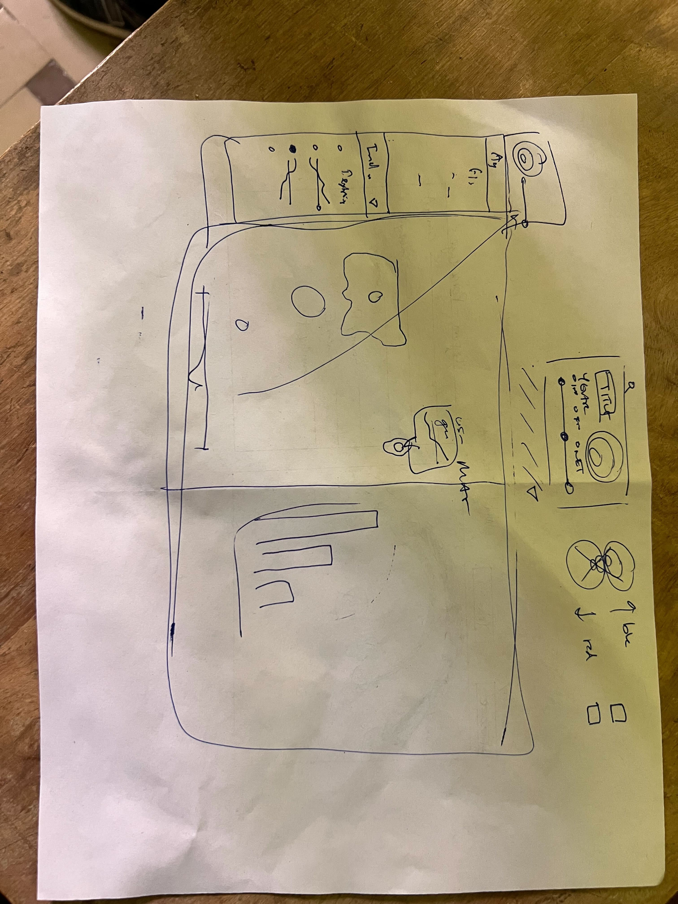

# Geog575 Final Project
# Team Name: U.S. International Trade
## Team members: 
Zac Pinard,
Kuang-Cheng Cheng,
Jianjin Chen
## Final Proposal
Outline:
1. persona/Scenario
 Shared_Repo for the Geog575 final project

Target User Profile (Persona):
Name & Position: Professor Bunyan is a professor of International Economics who needs to lecture his class on the U.S.'s role in international trade.  He would like to support this lecture by showing a quick snapshot of the scale of the U.S.'s exports and imports in various industries, as well as which countries the U.S. has strong trade relations with.  In this lecture, he would like to **compare** the exports of textiles to Mexico in 2021 and 2016.  He would also like to show any **trends**, **patterns**, and **clusters** of countries that the U.S. exports chemical products to.  Finally, he would like to **rank** the U.S.'s trade partners by percentage of U.S. metals they import.

Background Description: 
Scenario#1:
Upon arriving at the interface, the map shows a default **selection** for metal exports from the United States in 2021 with proportional symbols around each country that recieved U.S. metal imports in that year.  The professor **hovers** over each symbol to reveal a popup that **reexpresses** the metal export data in that country using a sparkline graph of metal exports from the U.S. to that country over time.  The professor then **searches** for Mexico using the search bar at the top and the map opens the popup window associated with the proportional symbol for Mexico. The professor then **selects** 2001 using the slider widget at the top and the proportional symbols update, and he **compares** the two years by pointing out how Mexico's symbol shrinks.  Finally, he goes to the accordion side panel on the left, **selects** the "Machinery" dropdown menu, and then **selects** "Electrical Machinery and Electrics" from the menu.  The proportional symbols update to display the data for U.S. exports of electrical machinery in 2001.  Finally, he changes the toggle at the top from exports to imports and the map **filters out** the export map and **overlays** the import map, so the proportional symbols reflect the import data for electric machinery in 2001.

2. Requirements Document
(1) Representation
a. Basemap of the World
b. Country Borders
c. Proportional Symbols for abosolute value of exports/imports
d. Legend
e. Overview
f. Accordion Panel with Sparklines
(2) Interaction
a. Search bar to let the users enter a country.
b. Individual country Pop-ups with sparkline of selected indsutry in selected country
c. Year Slider
d. Import/Export toggle

 Sources: 

 Overall:
 - https://oec.world/en/profile/hs/coffee-not-roasted-not-decaffeinated?latestTrendsYAxisSelector=linear#market-dynamics 
 

 Industries: 
 Fish:  
  -non-fillet frozen fish https://oec.world/en/profile/bilateral-product/non-fillet-frozen-fish/reporter/usa  
  - non-fillet fresh fish https://oec.world/en/profile/bilateral-product/non-fillet-fresh-fish/reporter/usa  
  - fish fillets https://oec.world/en/profile/bilateral-product/fish-fillets/reporter/usa  
 Machine:  
  - Machinery, mechanical appliances, & parts in United States https://oec.world/en/profile/bilateral-product/machinery-mechanical-appliances-parts/reporter/usa  
  - Electrical machinery and electrics. https://oec.world/en/profile/bilateral-product/electrical-machinery-and-electronics/reporter/usa  
  - Machines https://oec.world/en/profile/bilateral-product/machines/reporter/usa  
 Chemicals:  
  - organic chemicals https://oec.world/en/profile/bilateral-product/organic-chemicals/reporter/usa  
  - Chemical https://oec.world/en/profile/bilateral-product/chemical-products/reporter/usa  
  - halogenated hydrocarbons https://oec.world/en/profile/bilateral-product/halogenated-hydrocarbons/reporter/usa  
 Other Materials:  
  - Metal https://oec.world/en/profile/bilateral-product/metals/reporter/usa  
  - Textiles https://oec.world/en/profile/bilateral-product/textiles/reporter/usa  

